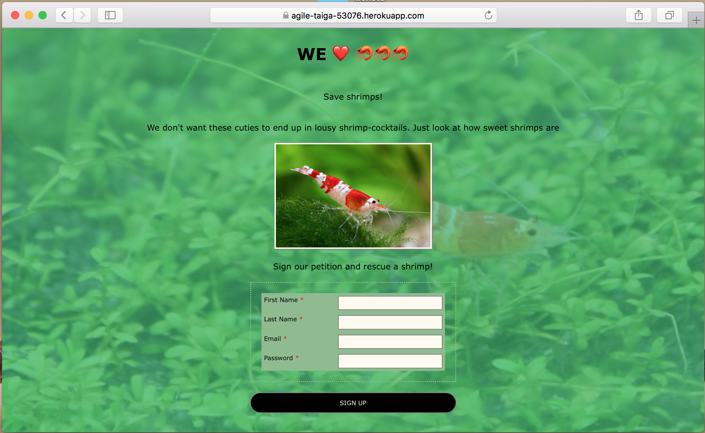
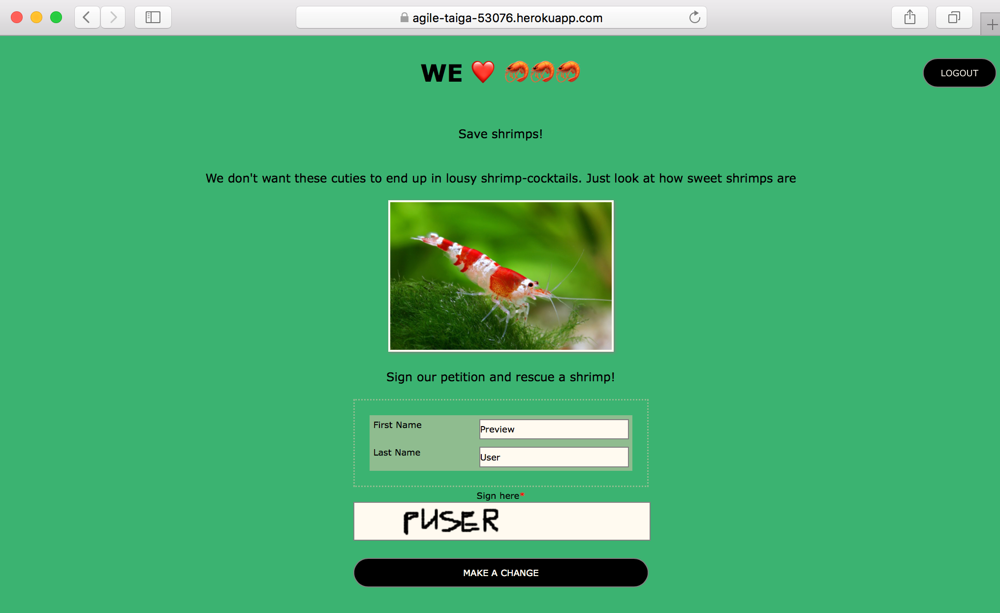
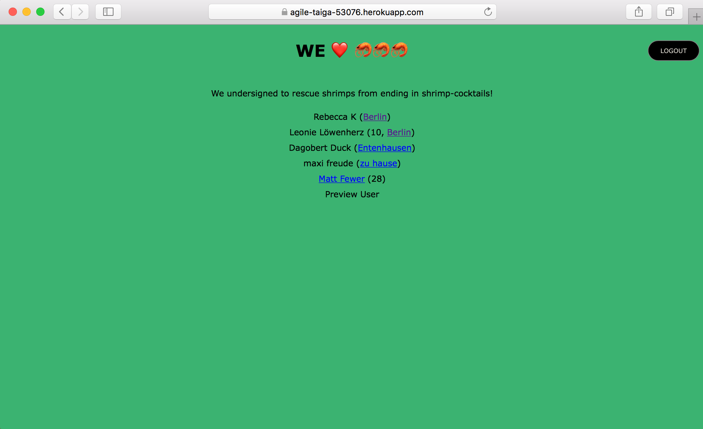

# Petition

## Overview
Users can sign a petition to save shrimps. After signing all signers will be listed with provided optional user profile information.
Hosted on [Heroku](https://agile-taiga-53076.herokuapp.com)

## Technologies
- Express-Handlebars
- Node.js
- Express.js
- PostgreSQL
- Redis
- AWS S3 for storing canvas-signature-image


## Details

### Login & Registration
The landingpage shows a video of my pet shrimp as background (deactivated on mobile), on which users can register or login.




### Sign petition
After registration (or upon login without having signed previously) users are asked to support the petition with signing on a canvas. The signature will be stored on AWS S3 and be displayed to the user on another page.




### List of Signers
After signing the user will be directed to a thank you page from which he can navigate to the list of all signers.



Via click on a city next to the signers, the user gets directed to a list of only signers of that city.


### Known Bugs
- user can sign twice within same session
- passwords stored un-hashed


### Planned Features
- store ```$('#canv')toDataURL();``` in different color
- include number of signers
- show timestamp
- error message when age not a number
- error message when login data incorrect (user not found please register / wrong pw)
- use canvas touch events
